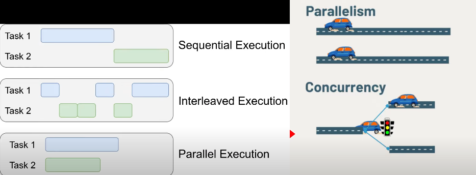
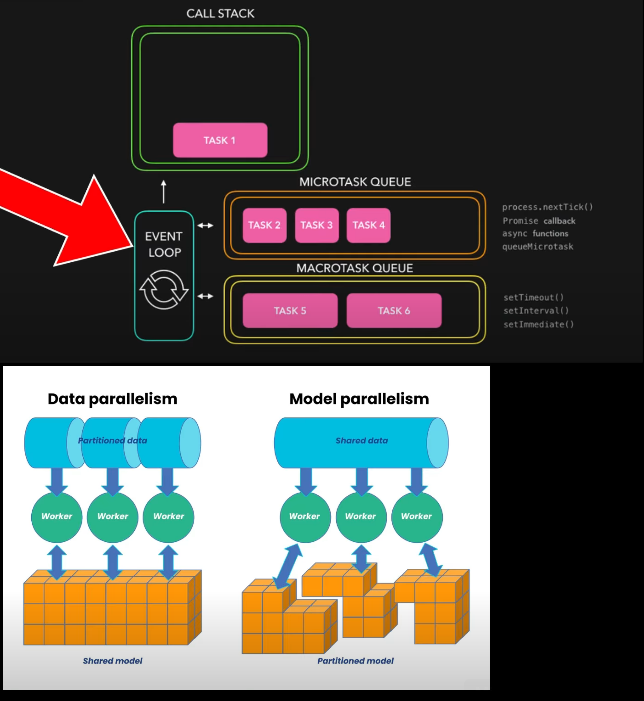
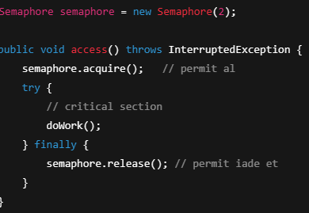
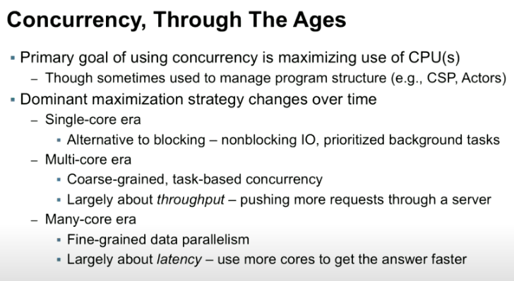

<h1>Concurrency</h1>

Bilgisayar kullanıcıları, sistemlerinin aynı anda birden fazla şey yapabileceğini varsayarlar.
Diğer uygulamalar dosyaları indirirken, yazdırma kuyruğunu(print queue) yönetirken ve ses akışı(stream audio) yaparken, bir kelime işleyiciyle(word processor) çalışmaya devam edebileceklerini varsayarlar.
Tek bir uygulamadan bile sıklıkla aynı anda birden fazla şey yapması beklenir. Örneğin, bu streaming audio uygulaması aynı anda dijital sesi ağdan okumalı, sıkıştırmasını açmalı, oynatmayı yönetmeli ve görüntüsünü güncellemelidir.
Kelime işleyicisi(word processor) bile, metni yeniden biçimlendirmekle veya ekranı güncellemekle ne kadar meşgul olursa olsun, klavye ve fare eventlerine yanıt vermeye her zaman hazır olmalıdır. Bu tür şeyleri yapabilen yazılıma concurrent(eş zamanlı) yazılım denir.
 
Buradaki kritik nokta “aynı anda çalışıyor gibi görünmesi”dir; her zaman gerçekten paralel çalışmak zorunda değildir.
 
concurrency -> Aynı anda birden fazla iş biriminin (thread, task, coroutine) ilerliyor olmasıdır. Bu işler gerçek paralel çalışmaz ama eşzamanlı görünür (özellikle single-core sistemde).
 
// Concurrency is property of a program's structure
 
parallelism -> Aynı anda birden fazla işin fiziksel olarak gerçekten paralel çalışmasıdır. Genellikle multi-core işlemcilerde görülür.
 
// Paralellism is property of a program's execution

Java platformu, Java programlama dilinde ve Java sınıf kütüphanelerinde temel concurrency(eş zamanlılık) desteğiyle concurrent(eş zamanlı) programlamayı desteklemek için baştan sona tasarlanmıştır.

5.0 sürümünden bu yana, Java platformu ayrıca üst düzey concurrency API'lerini de içermektedir. Bu ders, platformun temel concurrency desteğini tanıtmakta ve java.util.concurrent paketlerindeki high level API'lerden bazılarını özetlemektedir.

<h3>Processes and Threads</h3>

Concurrent(eşzamanlı) programlamada, iki temel execution unit vardır: process'ler(süreçler) ve thread'ler(iş parçacıkları). Java programlama dilinde, concurrent programlama çoğunlukla threadlerle ilgilenir. Ancak process'ler de önemlidir.

Bir bilgisayar sistemi normalde birçok aktif processes ve thread'e sahiptir. Bu yalnızca tek bir execution core'a(yürütme çekirdeğine) sahip olan ve bu nedenle belirli bir anda yalnızca bir thread'in gerçekten yürütüldüğü sistemlerde bile geçerlidir.
Tek bir core için processing zamanı, zaman dilimleme(time slicing) adı verilen bir işletim sistemi özelliği aracılığıyla processler ve threadler arasında paylaşılır.

Bilgisayar sistemlerinin birden fazla işlemciye(processor) veya birden fazla execution core'a sahip işlemcilere sahip olması giderek daha yaygın hale geliyor. Bu, bir sistemin concurrent process ve thread yürütme kapasitesini büyük ölçüde artırır, ancak concurrency, birden fazla işlemci veya execution core olmadan basit sistemlerde bile mümkündür.

<h3>Processes(işlem)</h3>
Bir process'in(işlem) kendi kendine yeten bir yürütme ortamı vardır. Bir işlem genellikle temel run-time kaynaklarının tam, özel bir kümesine sahiptir; özellikle, her işlemin kendi bellek alanı(memory space) vardır.

İşlemler genellikle programlar veya uygulamalarla eşanlamlı olarak görülür.
Ancak, kullanıcının tek bir uygulama olarak gördüğü şey aslında bir dizi iş birliği yapan işlem olabilir. İşlemler arasındaki iletişimi kolaylaştırmak için çoğu işletim sistemi, pipe'lar ve socket'ler gibi İşlemler Arası İletişim (IPC-Inter Process Communication) kaynaklarını destekler.
IPC yalnızca aynı sistemdeki işlemler arasındaki iletişim için değil, farklı sistemlerdeki işlemler için de kullanılır.

Java virtual machine'in çoğu gerçekleştirmesi tek bir işlem olarak çalışır. Bir Java uygulaması, ProcessBuilder nesnesini kullanarak ek işlemler oluşturabilir. Çoklu işlem uygulamaları bu dersin kapsamı dışındadır. (Multiprocess applications)

<h3>Threads</h3>
Threadler bazen lightweight processler olarak adlandırılır. Hem processler hem de threadleri bir yürütme ortamı sağlar, ancak yeni bir threadi oluşturmak yeni bir process oluşturmaktan daha az kaynak gerektirir.

Threadler bir process içinde bulunur. Her process en az bir tane thread içerir. Threadler, memory ve açık dosyalar dahil olmak üzere process'in kaynaklarını paylaşır. Bu, verimli ancak potansiyel olarak sorunlu bir iletişim sağlar.

Multithreaded execution, Java platformunun temel bir özelliğidir. Her uygulama en az bir threade sahiptir veya memory management ve signal handling gibi şeyler yapan "sistem" threadlerini sayarsanız birkaç threade sahiptir.
Ancak uygulama programcısının bakış açısından, main thread adı verilen tek bir threadle başlarsınız. Bu thread, bir sonraki bölümde göstereceğimiz gibi ek threadleri oluşturma yeteneğine sahiptir.

<h3>Core Sayısı neyi etkiler</h3>
Çoğu zaman multi-processor'unuz olsa dahi programı concurrency konusu baz almadan geliştirdiğinizde, muhtemelen program single-core çalışacaktır.
Yani 8 core'lu bir işlemcimiz varsa ve geliştirdiğimiz programı 8 core ile çalışabilecek şekilde yazmadıysak, program single-core çalışır
Ancak hatırlatmakta fayda var işlemciniz single-processor core olsa dahi multi-threading yapabilir (time slicing).

Aynı anda CPU üzerinde yürütülen (executing) thread sayısı ≈ aktif core sayısıdır.
- 8 core → aynı anda en fazla ~8 thread gerçekten çalışır
- Diğer threadler: Runnable ama sıra bekler veya Blocked / Waiting durumundadır

Hyper-Threading / SMT ->
Bir fiziksel core, 2 logical core gibi görünebilir ve OS bunu 16 core gibi algılar. Ama bu gerçek paralellik değildir, execution unit’ler paylaşılır.
Ancak yine de scheduler açısından: “Aynı anda çalışan thread sayısı = logical core sayısı” gibi davranır.

Thread Pool'lar core sayısı ile ilişkilidir. Paralel geliştirme için referans alınması gereken metrik: logical core sayısıdır.
Ancak üst sınır, fiilen fiziksel core sayısıdır.

<h3>Context switch illüzyonu (time slicing)</h3>
Context switch illüzyonunu oluşturan şey, OS scheduler’ın yaptığı preemptive scheduling ve time slicing mekanizmasıdır.
Scheduler çok hızlı context switch yapar, insan gözüyle “aynı anda çalışıyor” gibi görünür. Ama mikro seviyede her anda çalışan thread sayısı sınırlıdır.
Context switch'da her bir thread'e çok kısa bir süre tanınır, mevcut thread’in CPU register’ları, program counterları, stack pointerları kaydedilir ve yeni thread’in context’i yüklenir.
Bu context switch işlemi ücretsiz değildir bunun maliyetleri cache invalidation + pipeline flush gibi maliyetlerdir. (aşırı derecede thread sayısı = performans düşüşü).
JVM tarafında thread scheduling, modern JVM’lerde OS seviyesinde gerçekleşir. Java thread’leri, native OS thread’lerine (1:1 model) map edilir; JVM kendi scheduler’ını yazmaz, işletim sisteminin scheduler’ına güvenir.

Kısaca 200 thread varsa bunu 8 core'lu işlemcide çalıştırırsak; 8 thread aynı anda paralel olarak çalışır diğer 192 thread ready / runnable durumda tutulur.

<h3>OS's execution types</h3>
Sequential Execution ->Tüm işlemler tek bir sırada, ardışık olarak yürütülür. Bir işlem tamamlanmadan diğerine geçilmez.
 
Interleaved Execution -> Tek core üzerinde time slicing sayesinde birden fazla işlem birbirini keserek sırayla çalışır. Yani concurrent olarak çalışır ama gerçek anlamda paralel değildir.
 
Parallel Execution -> Gerçek anlamda fiziksel olarak aynı anda yürütülme sunar ancak multi-core gereksinimi vardır.
 

<h3>Multi-Threading</h3>
Bir program multi-threaded olabilir; ancak asenkron programlama modeli kullanmıyorsa, thread’ler synchronous (blocking) şekilde çalışır.
 
Bu durumda program sequential değildir; concurrent çalışır:
 
• Tek çekirdekli sistemlerde:
 
Thread’ler time slicing ile interleaved biçimde yürütülür.
 
• Çok çekirdekli sistemlerde:
 
Thread’ler gerçek paralel olarak aynı anda çalışabilir.

 
Önemli nokta:
 
Multi-threading ≠ asenkronluk
 
Multi-threading, concurrency veya paralellik sağlar; asenkronluk ise blocking’i ortadan kaldırır.
 
Multi-threading aynı anda birden fazla thread’in çalışabilmesidir. İşlemcide birden çok core varsa,
her biri farklı thread’leri paralel çalıştırabilir. Tek çekirdekli sistemlerde ise thread’ler time slicing ile sırayla yürütülür.

<h3>Single-Threading</h3>
Single-threaded bir programda asenkronluk mümkündür. Bu genellikle event loop, callback queue ve non-blocking I/O mekanizmaları ile sağlanır.
 
Bu modelde tek bir execution thread’i vardır, paralel execution yoktur buna rağmen concurrency mümkündür
 
Düşük Levele yakın (Java, C++) -> Thread'ler birbirini bloklamadan çalışır. ThreadPool, Future, Runnable
 
Daha Yüksek Seviye (JavaScript, Python asyncio) ->, bazı oyun motorları bu prensiple çalışır, Kod bloğu sonucu beklemeden devam eder (thread olmadan).
 
//single threaded eski uygulamalarda main event loop vardır. java awt, swing (brian goetz'in kitabında yer alıyor chapter 1.2)
 
Örnek olarak, JavaScript’te tek iş parçacıklı (single-threaded) bir event loop, gerçek paralel executiondan yoksun olmasına rağmen birden fazla I/O olayını concurrent olarak yönetebilir. Buna karşılık, matrix çarpımları içeren bir makine öğrenmesi modeli eğitimi, veri paralelliğinden yararlanarak birden fazla core veya GPU üzerinde paralel biçimde çalışabilir ve gerçekten aynı anda hesaplama yapabilir.

<h3>Synchronization ve Asynchronous</h3>
Asynchronous ve synchronization, thread’e özgü kavramlar değildir; yürütme modeli ve koordinasyon kavramlarıdır.
 
synchronization -> Synchronization, birden fazla thread’in paylaşılan(shared) mutable state üzerinde tutarsızlık yaratmasını engellemek amacıyla, erişimi kontrol eden ve koordine eden tekniklerin genel adıdır. Synchronization her zaman erişimleri sıraya koymaz; bazı durumlarda erişimi tamamen engeller, kotayla sınırlar ya da visibility ve ordering garantileri sağlar.
 
- Synchronized Blocks (  synchronized (lock) {x++;}   )  
- Semaphore  
- Explicit locks (Lock, ReentrantLock)  
- Method Level synchronization  
- Class Level synchronization  
- Variable-level synchronization (atomic variables, volatile variables)  

Bu veriye aynı anda birden fazla thread erişirse ne bozulur?
br>
Cevap “bozulur” ise:  
- O veriye erişen kod korunur  
- O kodun kullandığı lock tanımlanır  
 
// Atomicity – işlemler bölünemez şekilde yürütülür
 
// Semaphore, concurrency’de paylaşılan bir kaynağa aynı anda kaç thread’in erişebileceğini sınırlayan bir senkronizasyon primitive’idir.

asynchronous -> Bir işlemin başlatılıp sonucunun daha sonra alınmasıdır; bu süre boyunca caller bloklanmaz. Async kavramı thread’lere özgü değildir. Async bir iş aynı thread’de (event loop) veya farklı thread’lerde çalışabilir; önemli olan caller’ın beklememesi ve sonucun daha sonra gelmesidir. Async işler çoğu zaman shared mutable state’e dokunur; bu nedenle async olması thread-safe olmayı garanti etmez ve async olduğunda synchronization hâlâ gerekebilir.
 
Async şöyle sağlanabilir:  
- Callback tabanlı (event-driven)  
- Future/Promise tabanlı (result-driven)  
- CompletableFuture (event-driven + result-driven) -> Temel olarak Future/Promise tabanlıdır; ancak then* zincirleri ile callback benzeri, event-driven akışlar kurulabildiği için hibrit bir yaklaşımdır.
 
• ❌ “Async = multi-thread”  
• ❌ “Async = parallel”  
• ❌ “Async = thread-safe”  

https://www.youtube.com/watch?v=tjnGtDbU8l8&t=93s

<h3>Concurrency Mental Models</h3>
Concurrency tasarlarken yapılan en yaygın hata, thread sayısını optimize etmeye çalışmaktır. Oysa asıl kritik olan, problemi doğru concurrency modeliyle ele almaktır.
Bu hatayı önlemek için 2 temel mental model yeterlidir:  
1- CPU-bound workflows ->  
İş yükünün büyük kısmı CPU üzerinde hesaplama yapıyorsa bu kategoriye girer. Bu tür işlerde amaç, mevcut CPU çekirdeklerini verimli kullanmaktır. Thread sayısını artırmak performansı artırmaz; aksine context switch maliyetleri nedeniyle düşürebilir. Bu nedenle concurrency sınırlı tutulur ve thread sayısı genellikle core sayısına yakın seçilir.
 
2- I/O-bound workflows ->  
İşlerin büyük bölümü I/O bekleme süresinde geçiyorsa bu kategoriye girer. CPU çoğu zaman boştadır ve concurrency’nin temel amacı, I/O bekleyen işler varken CPU’nun boş kalmasını engellemektir. Bu modelde daha fazla eşzamanlı iş anlamlıdır; ancak klasik thread modelinde bu, thread yönetimi maliyetleriyle sınırlıdır.
   
Concurrency kurgularken bu 2 mental modeli, thread sayısını mikro-optimize etmek için değil; yanlış concurrency stratejisini seçmemek için öğreniriz. Performans problemlerinin büyük kısmı thread sayısı değil, yanlış concurrency modeli seçildiği için meydana gelebilir.

<h3>Execution / Concurrency Strategy</h3>
OS Threads (Java, C++ Threads – 1:1 mapped language threads) ->
 
Virtual Threads ->
 
Virtual thread, “ileride çok concurrency olacak” ihtimaline karşı, design başında hesaba katılır; ancak gerçekten ihtiyaç doğduğunda devreye alınır. Virtual Thread'ler bir runtime feature'dir ama bazılarına göre aynı zamanda bir mental modeldir çünkü öncesinde ki “thread'ler pahalıdır” görüşünü bir nebze yıkmıştır.
   
Reactive ->
